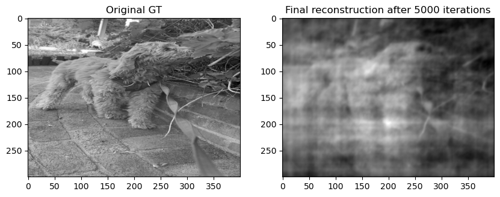

# Diffuser cam (lensless photography)

This project deals with the inverse problem of lensless photography with a PSF as the forward model. Using gradient descent, this project recovers the ground truth image.

<!-- example image -->

Below is an example reconstruction and a gif of the reconstruction process.



## Installation and Usage

To install the required packages, run the following command in a VirtualEnv:

```bash
pip install -r requirements.txt
```
To get the result of the example, run the following command:

```bash
python construct.py --img_path images/gabby.jpeg --iters 5000 --mps --f 1  --save_interval 5 --type grad --psf_path images/psf_sample.tif --show_imgs 
```

## Optional Flags
- `--f`: Factor to resize the images by
- `--iters`: Number of iterations to run the optimization for
- `--save_interval`: Interval for saving frames
- `--gif_save`: Save a gif
- `--mps`: Use MPS (for silicon macs)
- `--show_imgs`: Show images
- `--type`: Type of reconstruction to use
